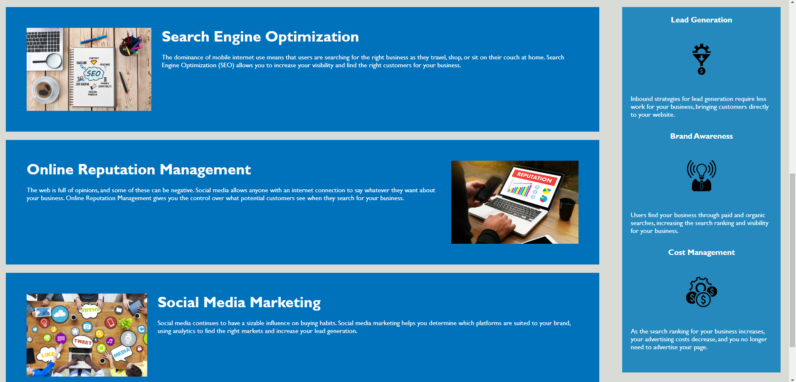

# HTML CSS Git Challenge: Code Refractor

## Weekly Challenge: One -

University of Utah
Full-Stack Coding Bootcamp

- Fall 2022 - Spring 2023

## Description

This codebase adheres to accessibility standards to ensure optimal performance in search engines. By incorporating semantic HTML elements, maintaining a logical structure independent of styling, providing accessible alt attributes for images, ensuring sequential order of heading attributes, and crafting concise and descriptive title elements, we optimize our site for accessibility and search engine optimization (SEO). This commitment to accessibility not only enhances user experience but also improves discoverability and indexing by search engines.

## Table of Contents 

  - [User Story](#user-story)
  - [Acceptance Criteria](#acceptance-criteria)
  - [License](#license)
  - [Screenshots](#screenshots)
  - [Links](#links)
  - [Contact Me](#contact-me)

## User Story

- AS A marketing agency
- I WANT a codebase that follows accessibility standards
- SO THAT our own site is optimized for search engines

## Acceptance Criteria

- GIVEN a webpage meets accessibility standards
- WHEN I view the source code
- THEN I find semantic HTML elements
- WHEN I view the structure of the HTML elements
- THEN I find that the elements follow a logical structure independent of styling and positioning
- WHEN I view the image elements
- THEN I find accessible alt attributes
- WHEN I view the heading attributes
- THEN they fall in sequential order
- WHEN I view the title element
- THEN I find a concise, descriptive title

## License

  This project is licensed under the terms of the MIT license.
  [License Information](https://choosealicense.com/licenses/mit)
   
   
  

## Screenshots

## Link

  * Application Link: https://thekelsenator.github.io/HTML-CSS-Code-Refactor-01/
  * LinkedIn Profile: https://www.linkedin.com/in/kelsey-o-kelley-23057a20b/

  ## Contact Me

  Feel free to reach out to me via email at km.okelley89@gmail.com or through my LinkedIn.